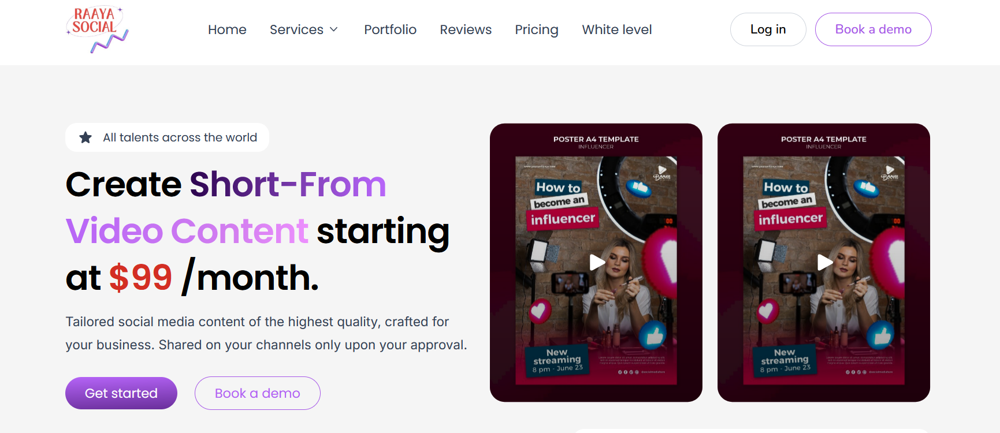

  # A WebApp for short video making using plain html, css and javascript

  

## Features

## Technologies Used

* HTML
* CSS
* JavaScript

## Installation and Setup

1.  **Clone the repository:**
    ```bash
    git clone [your-repository-url.git]
    cd [your-repository-directory]
    ```

2.  **Install Live Server (Recommended):**
    * If you don't have Live Server installed, you can install it as a VS Code extension or as a Node.js package.

    * **VS Code Extension:**
        1.  Open VS Code.
        2.  Go to the Extensions view (Ctrl+Shift+X or Cmd+Shift+X).
        3.  Search for "Live Server" and install it.

    * **Node.js Package (if you have Node.js and npm installed):**
        ```bash
        npm install -g live-server
        ```

3.  **Run the Web App:**

    * **Using VS Code Live Server:**
        1.  Open the `index.html` file in VS Code.
        2.  Right-click anywhere in the file and select "Open with Live Server."

    * **Using Node.js Live Server:**
        1.  Navigate to the project directory in your terminal.
        2.  Run the following command:
            ```bash
            live-server
            ```

    * Your web app should open in your default browser.

## Usage


## Contributing


## License


## Author


  